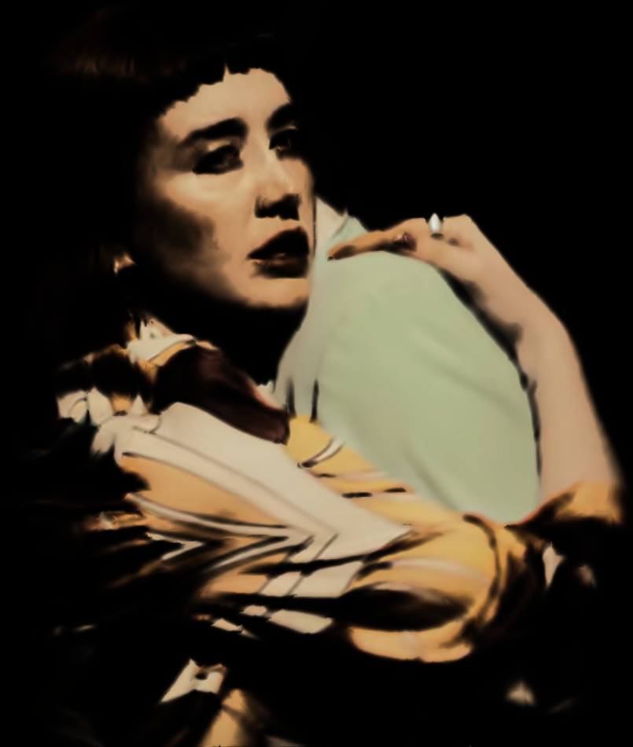

# Art Gen/ Resilium

A project made during my free time that allows users to make art by uploading images and editing them
through various algorithms using vanilla JS and OpenCv. The "dog" algorithm is based on a research paper (linked below)
describing an extended difference of gaussians algorithm that inspired me to make this project.

Please note that there may be some bugs. If an algorithm takes more than a minute to finish, refresh the page.

Feel free to fork this project and improve it. Please give credit :)

[Northwestern Paper](https://users.cs.northwestern.edu/~sco590/winnemoeller-cag2012.pdf)

[Project Website](https://edrickgro.github.io/ArtGen/)

## Difference of Gaussians
The [difference of gaussians](https://en.wikipedia.org/wiki/Difference_of_Gaussians") algorithm is an algorithm used in image processing. There
are many uses for it but my implementation is a rough implementation. Many art styles
can be mimicked by simply altering the various variables, most notably charcoal, water paint, pencil, and comic book. The process of adding color and texture to
the final image can be forever improved. My algorithm is mostly focused on the basic implementation itself. The main principal is calculating two different gaussian
blurs using different standard deviations (std_e and (std_e * k)) and subtracting them using the (1 + t)*(First Gaussian) - (t)*(Second Gaussian) formula. An edge tangent
flow is calculated and then blured (std_c). The difference of gaussian is calculated by using this edge tangent flow and bluring across the edges. 

A final blur (std_m) is the calculated along the edges to reduce noise. 
The resulting value is then set to 1 if its above e. If not, it passed through a formula (o). The lower o is, the more gradients the final image will have.

## Examples of DoG

